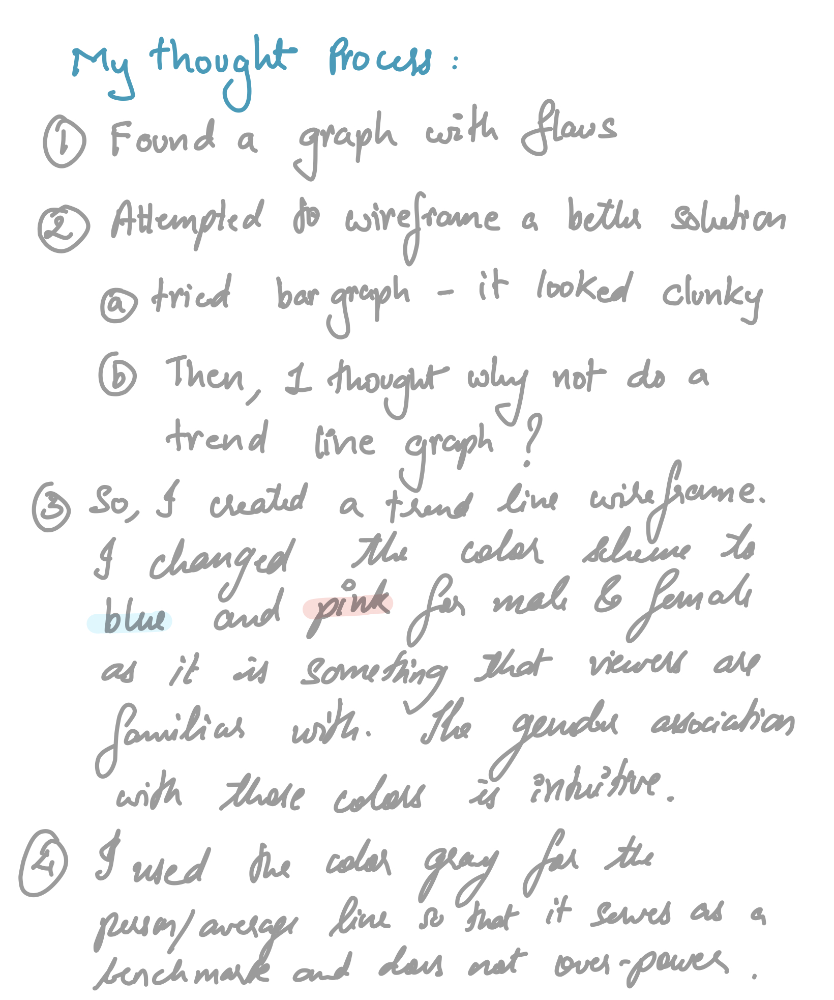

<h1>Design Critique</h1>
 

The graph I am going to critique is taken from a health report by Goverment of India. It shows the %proportion of persons treated as in-patient in India as per gender and age groups.

 

 
<a href="http://mospi.nic.in/sites/default/files/publication_reports/NSS%20Report%20no.%20586%20Health%20in%20India.pdf">Source: NSS Report no. 586: Health in India, Pg 31</a>
 
<h2>The Process</h2>
 
 

<h2>The Wireframe</h2>
 

<h2>User Feedback</h2>
 

<h2>Final Redesigned Data Vizualization</h2>

 

<h2>Final Thoughts</h2>

The change of graph from bar graph to trend graph changed the visual tremendously. It became easier to read. We can now observe the way trend lines for male and female change over the age groups. The elimination of 3-d bars and shadow effect eliminated the clutter. A clener, to the point graph makes for a better case.

