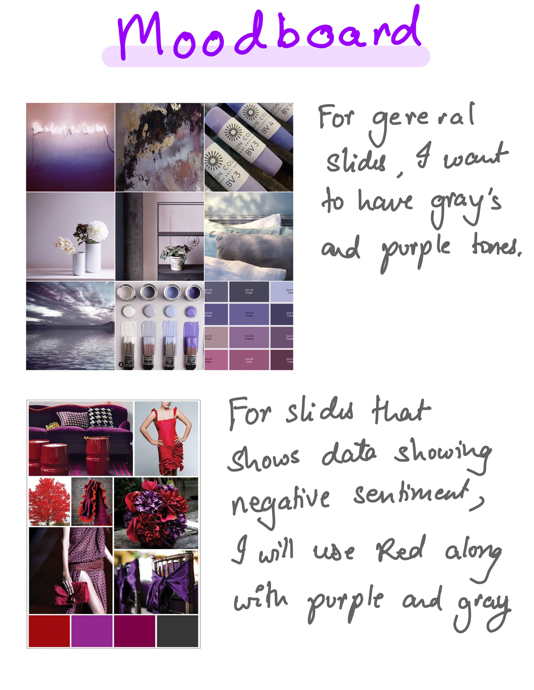

<h1>Part II, Final project wireframes / storyboards and user research</h1>

<h2> Wireframes and Storyboard </h2>

I made the design shown below such that it incoperates both the story and wireframe.

I decided to use combination of bold statements to supplemet my data. Many of the slides have one statement with the most important word in the shade of purple to make a point. I decide to use the color scheme of gray and purple. I will be using red as well where the data shows a negative trait. I will use red exculsively to highlight bad news.

My flow of narrative is such that I take a myth such as 'Asians are good at math' and bust it with data. I tackle 3 such myth in my wireframe below. I also build a narrative around why busting those myths is essential.

 
 
 
 
 
 
 
 
 
 
 

<h2>My Target Audience </h2>

My target audience are socially conscious people with good intentions towards the Asian community. This group would include activists and people having Asian friends or people who care about well-being of Asian people. This would also include people living in multi-cultural communities such as universities. 

 
<h2>How I chose individuals to interview</h2>

I wanted to interview people who make an effort to be socially conscious and inhabit multi-cultural spaces. I wanted to make sure I interviewed people belonging to different races and gender.

I interviewed a total of 3 people. One was American/White. Second one was Aisan. Third was Asian(Indian).

2 out the 3 were female and the remaining one was male.

 
<h2>My Interview Script</h2>

I asked the below questions:

<ul>
  <li>What is your first impression?</li>
  <li>Were you able to understand the topic? </li>
  <li>Does the flow of the narrative make sense?</li>
  <li>What do you think about the data vizualization?</li>
  <li>What do you think about the color scheme?</li>
  <li>What improvements would you recommend?</li>
</ul> 
<h2>Findings from the Interviews</h2>

All 3 people liked the color scheme and the narrative.

They pointed out some flwas as well:

<ul>
  <li>The graph of cities can be done better</li>
  <li>Is this data US specific?</li>
  <li>Ending could be more actionable</li>
  <li>Not sure what Model Minority Myth is.</li>
</ul> 
<h2>Future Plans for Changes Based on feedback</h2>

I will...

<ul>
  <li>Use map of USA to show rise of hate crimes in cities instead of line graphs for multiple cities.</li>
  <li>Tell that the data is US specific in the first few slides</li>
  <li>End with how we can be a better ally to Asians</li>
  <li>Explain what Model Minority myth is at the start and tell where it originates from.</li>
</ul> 

 
<h2>Moodboard</h2>

 
